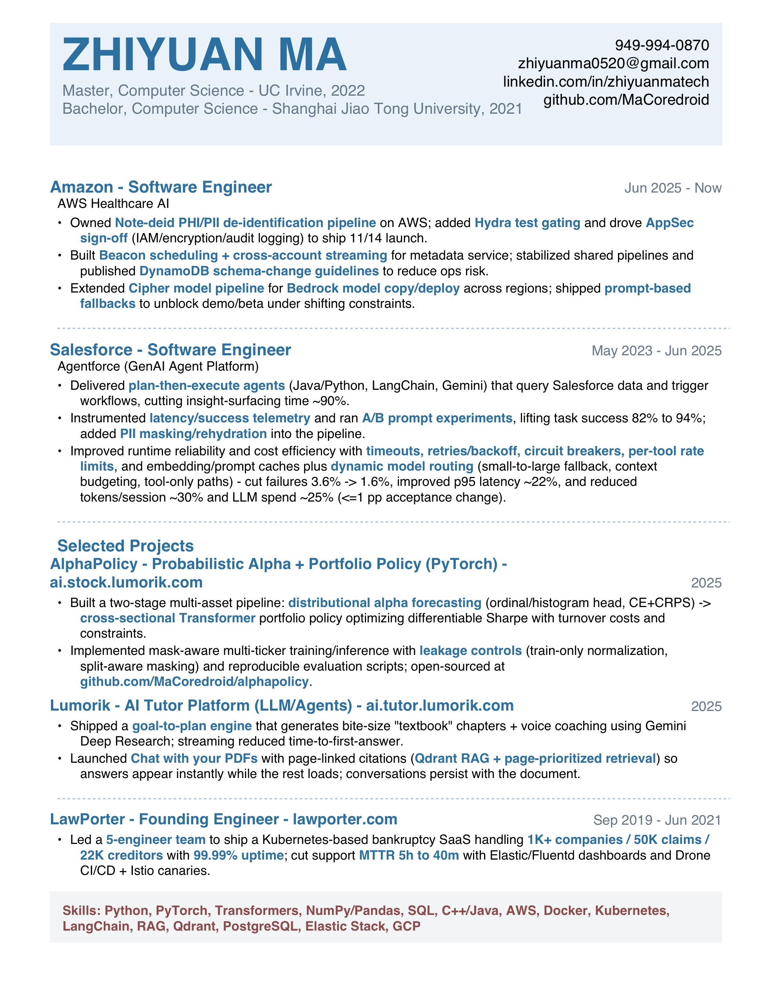

# Zhiyuan Ma

[Resume (PDF)](zhiyuan_ma_resume_updated_quant_v2.pdf)

## Projects

- **AI.Tutor** ([ai.tutor.lumorik.com](https://ai.tutor.lumorik.com))  
  AI-powered adaptive learning that evolves with you—personalized study paths, real-time feedback, and progress tracking to help you master any subject faster.  
  _Target audience:_ students, lifelong learners, interview/exam preppers, and professionals upskilling into new domains.

- **AI.Voice** ([ai.voice.lumorik.com](https://ai.voice.lumorik.com))  
  Voice-first assistant built on **VoicePipeline** (a real-time voice agent stack) for live transcription and natural, interactive conversation.  
  _Target audience:_ builders of voice apps/agents, teams capturing meeting & call notes, creators/podcasters, and accessibility-focused products.

- **AI.Stock** ([ai.stock.lumorik.com](https://ai.stock.lumorik.com))  
  AI-powered stock insights and summaries via **AlphaPolicy**—designed to help you scan faster, compare narratives, and stay organized in your research workflow.  
  _Target audience:_ retail investors, active traders, finance students, analysts, and fintech builders. _(Not financial advice.)_

